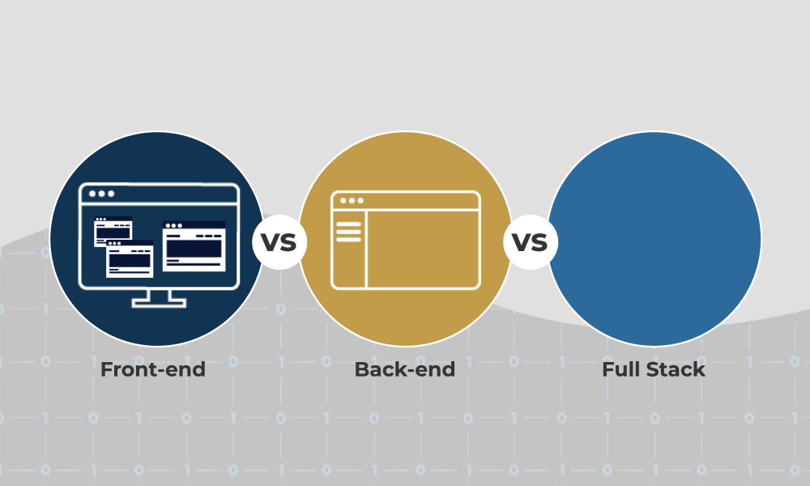

# 📌 Contents of my fullstack projects and lecture notes

It contains my repo information covering both front-end and back-end aspects of my software development process. In this context, I took notes on the methods 
I saw in both paths during the training process and tried to apply them practically to the projects. If you would like to help me in my development regarding the content, you can let me know. Thank you in advance.

---


## 📋 İçindekiler

1. [Hakkında](#hakkında)
2. [Özellikler](#özellikler)
3. [Kurulum](#kurulum)
4. [Kullanım](#kullanım)
5. [Katkıda Bulunma](#katkıda-bulunma)
6. [Lisans](#lisans)
7. [İletişim](#iletişim)

---

## 🔍 Hakkında

Bu projede **(projenizin kısa açıklaması)** hedeflenmiştir. Bu projenin temel özellikleri ve kullanım alanları:

- Özellik 1
- Özellik 2
- Özellik 3

---

## ✨ Özellikler

- [ ] Özellik 1
- [ ] Özellik 2
- [ ] Özellik 3

---

## 🛠️ Kurulum

Projeyi kendi bilgisayarınıza klonlayın:

```bash
