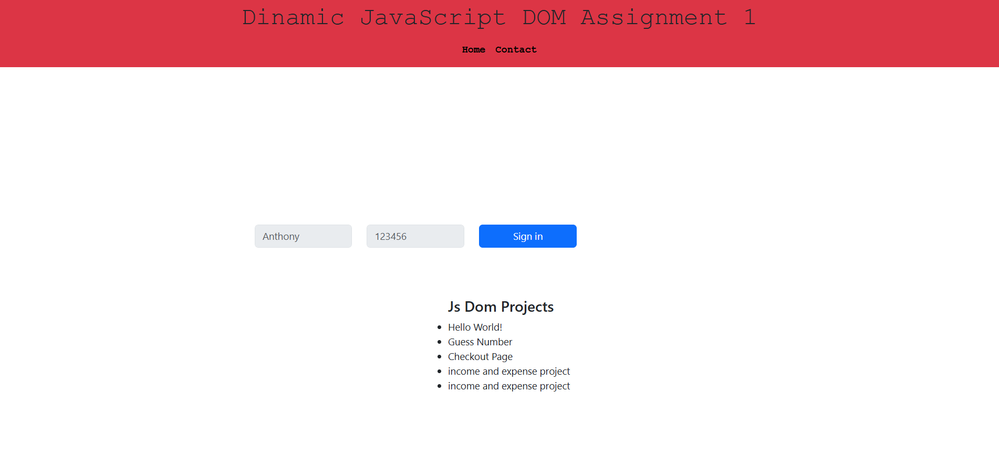

### JavaScript DOM Assignment 1

### Amaç:

- Bu görevin amacı, öğrendiklerinizi pekiştirmek. JS DOM kullanarak verilen html yapısını aşağıdaki adımlarla modifiye etmemiz beklenmektedir. 

### img

### Demo
[Live](https://yavuzahmet1.github.io/fullstack-clarusway/frontend/homeworks/14-DOM-assignment/)

### Adımlar:

1. ilk önce boostrap eklentisi alındı ve js tarafında tek tek ilgili element oluşturularak gerekli tanımlamaları yapıldı.

2. Bunlar yapılırken ilgili elementler ana elementine appendChild() ile sonuna doğru eklenerek yapıldı. 
 
3. temel style, className gibi yapılar ile gerekli tanımlamaları yapıldı, setAttribute ile diğer attributeler tanımlandı.

4. <head> kısmına bootsrap style bağımlılığı,

5. <body> kısmına bootsrap js bağımlılığı dinamik olarak eklendi
